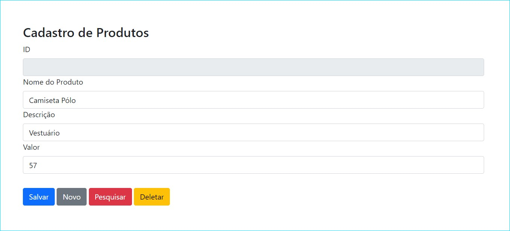
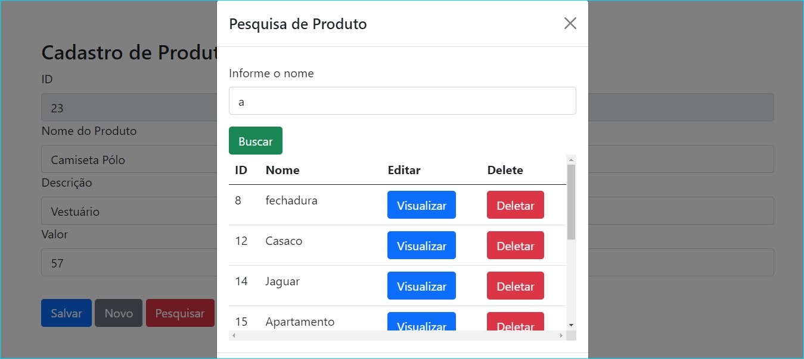

# Product_System

<h1 align="center">
   Product_System
</h1>

Sistema de produtos desenvolvido em Java, Springboot, Html, Bootstrap e JQuery integrado com banco de dados PostgreSQL.   
 Nele o usuário pode cadastrar produtos, listar, atualizar ou deletar-los.
  
  

## Página de Cadastro de Produtos   

   
## Modal de Pesquisa     
   

